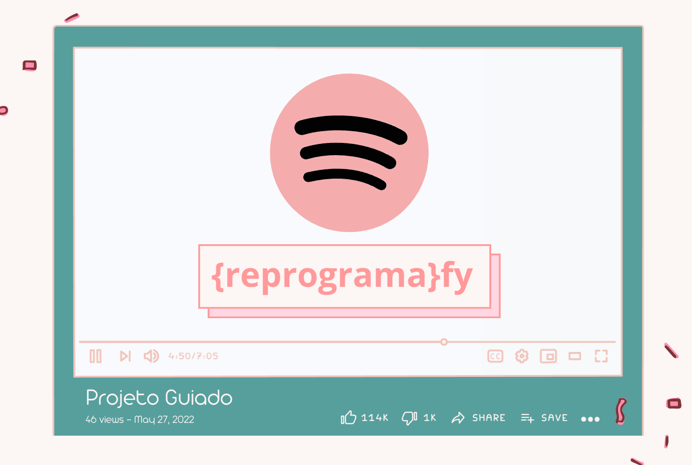

<h1 align="center">
    <br>
    <p align="center">Reprograma - Semana 10 (Projeto Guiado)<p>
</h1>

# Projeto API Nodejs "{reprograma}fy"




<br>


A listagem de músicas será no seguinte formato: ```{ titulo, ano de lançamento, favoritada, artistas }```

O novo produto de músicas deverá:

- [x] poder listar todas as músicas da playlist do usuário
- [x] poder listar apenas uma música específica
- [x] poder listar  músicas de um artista específico
- [x] poder adicionar uma nova música
- [x] poder remover uma música da lista
- [x] poder alterar informações da música
- [x] poder favoritar/desfavoritar uma música

Sendo assim precisaremos criar 7 rotas para músicas:

| Verbo  | Descrição da Rota                      |
| ------ | ---------------------------------------|
| GET    | Listar músicas                         |
| GET    | Listar uma música específica           |
| GET    | Listar música por artista              |
| POST   | Adicionar nova música                  |         
| DELETE | Remover música                         |
| PUT    | Alterar informações da música          |
| PATCH  | Favoritar/desfavoritar música          |


<br>


### API Pronta!!

Desenvolvemos todas as rotas necessárias para nosso produto da reprogramafy. Criamos a rota de POST (que cria uma nova musica), tres rotas de GET (uma para trazer todas as musicas, uma para trazer uma musica dado o id e a última para trazer as musicas dado o artista), PUT (para alterar a musica), PATCH (para alterar o status de favorito da musica) e DELETE (para deletar a musica). Com todas as rotas desenvolvidas na nossa API de musicas está pronta pra ser lançada!!


---