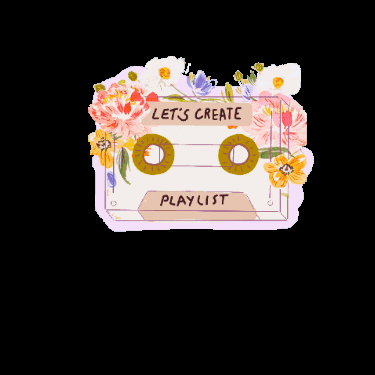

# PROJETO GUIADO DA REPROGRAMA




# AULA MINISTRADA POR Mayhhara Moraes

# O que este projeto vai entregar? 

Este projeto trata-se de uma construção de uma API para playlist e podcasts. Neste API será possivel obter os seguintes serviços:
 * Retornar todas as músicas 🎶;
 * Retornar apenas uma música específica 🎵;
 * Retornar música de um artista específico 👩‍🎤;
 * Cadastrar nova música ✍️;
 * Atualizar uma música específica - EXCETO o 🆔;
 * Deletar uma música especifica 🔥;
 * Favoritar ❤️ e desfavoritar 💔 uma música.


#### Verbos Utilizados:
* GET - PUT - POST -DELETE E PATCH

#### TRY CATCH
* try  é uma declaração que marca um bloco e especifica uma resposta, quando uma exceção é lançada. Há três forma de utilizar o try sendo elas:

try catch: Uma cláusula catch contém declarações que especificam o que fazer caso uma exceção seja lançada no bloco try. Ou seja, se você quer que o bloco try tenha êxito, e caso não tenha, você quer que o controle passe para o bloco catch. Caso qualquer declaração dentro do bloco try  (ou em uma função chamada no interior do bloco try) lançar uma exceção o controle imediatamente muda para a cláusula catch. Se nenhuma exceção for lançada no bloco try a cláusula catch é ignorada.

try finally: A cláusula finally é executada após a excecução do bloco try e da(s) cláusula(s) catch porém antes das declarações seguintes ao try. Ela sempre é executada, independente se uma exceção for lançada ou capturada.

try catch finally  trata-se de uma composição aninhada.
fonte: Mozilla

OBS: o assunto try não se esgota por aqui, porém o projeto foi utilizado o try catch.

#### FIND E FINDINDEX
* Find:

* FindIndex:

#### 


<h1 align="center">
    <br>
    <p align="center">Reprograma - Semana 10 (Projeto Guiado)<p>
</h1>

Olaaaaaaa! Sejam bem-vindas a Semana 10 de projetinho! Meu nome é Mayhhara Morais e vou acompanhar vocês nesse projeto.


### Ferramentas e tecnologias utilizadas:


# Vamos começar!

# Projeto API Nodejs "{reprograma}fy"


Parabéns, você foi escolhida para desenvolver um novo produto que deverá ser lançado em breve. Que tal montarmos nossa própria playlist de músicas? Na nossa playlist poderemos favoritar nossas músicas e ver quais artistas tocam a música. Além disso, poderemos inserir novas músicas ou remover da nossa playlist as que não queremos mais. Não curte músicas? Tem espaço pra podcast também!! No nosso {reprograma}fy você poderá listar todos os podcasts e também filtra-los por tópico. Somado a isso, pode também inserir novos podcasts ou remover algum já existente, além de conseguir avaliá-lo.
<br>

Você será a desenvolvedora backend responsável pelo desenvolvimento da API que deverá ser feito em Nodejs.

A listagem de músicas será no seguinte formato: ```{ titulo, ano de lançamento, favoritada, artistas }```

A listagem de podcasts será no seguinte formato: ```{ nome, nome da apresentadora(podcaster), tópico, nota }```


O novo produto de músicas deverá:

- [x] poder listar todas as músicas da playlist do usuário
- [x] poder listar apenas uma música específica
- [x] poder listar  músicas de um artista específico
- [x] poder adicionar uma nova música
- [x] poder remover uma música da lista
- [x] poder alterar informações da música
- [x] poder favoritar/desfavoritar uma música

Sendo assim precisaremos criar 7 rotas para músicas:

| Verbo  | Descrição da Rota                      |
| ------ | ---------------------------------------|
| POST   | Adicionar nova música                  |
| GET    | Listar música                          |
| GET    | Listar uma música específica           |
| GET    | Listar música por artista              |
| DELETE | Remover música                         |
| PUT    | Alterar informações da música          |
| PATCH  | Favoritar/desfavoritar música          |


O novo produto de podcasts deverá:

- [x] poder listar os podcasts
- [x] poder listar os podcasts por tópico
- [x] poder adicionar um podcast
- [x] poder remover um podcast da lista
- [x] poder alterar a nota do podcast

Sendo assim precisaremos criar 5 rotas para podcasts:

| Verbo  | Descrição da Rota                      |
| ------ | ---------------------------------------|
| POST   | Adicionar novo podcast                 |
| GET    | Listar podcasts                        |
| GET    | Listar podcast por tópico              |
| DELETE | Remover podcast                        |
| PATCH  | Alterar a nota de um podcast           |

### Iniciando a API Nodejs

Com o terminal aberto na pasta "reprogramafy", para iniciar nossa API Nodejs, precisamos inicializar o *package manager*, que é o gerenciador de pacotes do Node. Para isso executaremos ```npm init``` no terminal. Pressionando “Enter”, serão exibidas uma sequência de perguntas que deverão ser preenchidas ou mantidas o valor padrão.
    
Com isso um arquivo com o nome de package.json será criado. Esse arquivo é muito importante pois define que o nosso projeto como sendo Node.

### Instalando o Express

Feito isso, precisaremos instalar o Express no nosso projeto, que é um framework que nos trará facilidades. Para isso executaremos no terminal:

``` npm install express --save ```

Ao rodar a instalação do express, uma *pasta node_modules* com os pacotes do meu projeto será criada. Se reparar, dentro dessa pasta teremos uma pasta chamada “express”. Toda vez que você rodar o comando ``` npm install``` essa pasta node_modules será atualizada com as últimas atualizações conforme o que estiver configurado no arquivo *package.json*.

### Criando o arquivo .gitignore

Devemos criar na raíz do "reprogramafy" o arquivo *.gitignore* e escrever nele ```node_modules/``` para o git nao trackear essa pasta para commit.

### Criando a estrutura da nossa API

Primeiramente, iremos criar uma pasta chamada “src” (de “source”) na raiz do nosso projeto, onde armazenaremos todos os códigos da aplicação. Dentro dessa, criaremos três pastas:

- [x] controllers - para armazenar a lógica de controle da nossa api
- [x] models - para armazenar os nosso modelos (ex: nossas músicas)
- [x] routes - para armazenar as rotas

```
reprogramafy
├── src
│   ├── controllers
│   ├── models
│   ├── routes
├── package.json
```
### Criando o servidor

Deveremos criar dentro de *src/* um arquivo chamado *app.js*. Nesse arquivo faremos as configurações da nossa aplicação. Configuraremos a mesma para utilizar o express. Nesse arquivo criaremos uma constante express que receberá o módulo express. Utilizaremos essa constante para configurar nossa aplicação:

```app.js
// centralizando o conteudo da aplicacao

const express = require("express") //importando o express

const app = express() // executo o express

app.use(express.json()) // uso o bodyparser


// exportando para usar o server.js
module.exports = app

```
O *app.use* adiciona uma middleware na nossa aplicação. Por exemplo, quando fazemos ```app.use(express.json())```, estou dizendo que minha api irá trabalhar com json. Isso significa, por exemplo, que quando eu fizer um POST, minha api irá entender que vou receber um json.

Criaremos agora, na raíz de "reprogramafy", um arquivo chamado “server.js” para configurarmos nosso servidor. Nesse arquivo criaremos uma constante *app* que receberá nossa aplicação express que criamos no arquivo *app.js*. No caso definimos a porta 1313 para o nosso servidor rodar quando for inicializado.

```server.js
const app = require("./src/app") //chamando o arquivo app

const port = 1313 //PORTA

//iniciando o servidor
app.listen(port , ()=>{
    console.log(`Servidor está rodando na porta ${port}`)
})

```

Quando criamos o servidor utilizando o protocolo HTTP, definimos um callback que será executado sempre que recebermos uma requisição web. Nesse caso, esse callback seria executado quando o nosso servidor for iniciado e aparecerá a mensagem “Servidor está rodando na porta 1313.

Como nosso arquivo que irá inicializar o servidor se chama "server.js", devemos informar isso no arquivo *package.json* alterando ```"main": "index.js"``` para ```"main": "server.js"```.

### Nodemon

Caso você esteja com o servidor rodando e tente alterar algum arquivo, para que o servidor capte essas alterações será necessário reiniciá-lo manualmente. Porém é bem chato ficar fazendo isso. Para evitar esse tipo de problema, podemos utilizar o *nodemon* para inicializar nosso servidor. Para utilizá-lo, deveremos primeiramente instalá-lo rodando o comando ```npm install nodemon --save```. Com o nodemon instalado, para rodar nosso servidor o utilizando, deveremos utilizar o comando ```nodemon server.js```. Com isso nosso servidor será inicializado com o nodemon e você poderá editar seus arquivos sem precisar reiniciá-lo.

### Scripts package.json

Para não precisar ficar escrevendo ```nodemon server.js``` para inicializar o servidor, podemos ir no nosso arquivo *package.json* e editar o atributo "scripts" do json. Poderemos incluir um script de start, informando que quando ele for utilizado, executará o comando ```nodemon server.js```:

```package.json
"scripts": {
    "test": "echo \"Error: no test specified\" && exit 1",
    "start": "nodemon server.js"
  }
```
Dessa forma para inicializar o servidor, basta digitar ```npm start``` no terminal e pressionar enter, que o mesmo já chamará automaticamente o comando ```nodemon server.js```.

### Vamos criar nossas rotas

### Nova rota de GET para retornar as musicas

A empresa reprogramafy acabou de te enviar uma base de dados de exemplo chamado *musicas.json* e *podcasts.json* que ficam guardadinhos na pasta *models*. Essa contém uma listagem de musicas/podcasts que deveremos trabalhar. Com a listagem em mãos, poderemos desenvolver uma rota GET que exibirá essa listagem toda vez que uma requisição para listar as musicas/podcasts seja chamada.

 Iremos, em seguida, na pasta *routes* e criaremos um arquivo chamado *musicas.js* e em seguida criaremos um arquivo chamado *podcasts.json*. Nessas, iremos armazenar todas as rotas referentes as musicas e podcasts, respectivamente. Nosso projeto deverá estar com a seguinte estrutura:

```
reprogramafy
├── src
│   ├── controllers
│   ├── models
|       ├── musicas.json
|       ├── podcasts.json
│   ├── routes
│       ├── musicasRoutes.js
│       ├── podcastsRoutes.js
|   ├── app.js
├── package.json
├── server.js
```

Primeiramente, deveremos informar a nossa aplicação que iremos utilizar as rotas que iremos criar para as musicas/podcasts. Para isso deveremos abrir a pasta *src* e editar o arquivo *app.js* 

```app.js
const musicasRoutes = require("./routes/musicasRoutes")
const podcastsRoutes = require("./routes/podcastsRoutes")

// criar uma rota raiz
app.use("/playlist", musicasRoutes)
app.use("/podlist", podcastsRoutes)

```

Estamos dizendo para a aplicação utilizar as rotas dos arquivos *musicasRoutes.js* / *podcastsRoutes.js* e utilizar a rota "/playlist" para musicas ("/podlist" para podcasts),  para executá-las. Isso significa que toda vez que você chamar *http://localhost:1313/playlist*, a nossa rota de playlist musicas será chamada. (O mesmo se aplica para *http://localhost:1313/podlist*)

Entretanto, ainda não escrevemos nenhuma rota. Para escrever nossa primeira rota que listará as musicas, deveremos abrir a pasta *routes* e editar o arquivo *musicasRoutes.js* e *podcastsRoutes.js*: 

```musicasRoutes.js
const express = require("express")
const router = express.Router()
const controller = require("../controllers/musicasController")

router.get("/musicas", controller.getAllMusics)
router.get("/musica/buscar/:id", controller.getMusicById)
router.get("/musica/artista", controller.getMusicByArtist)


module.exports = router;
```

Nessa estamos dizendo que toda vez que for utilizado o verbo GET na chamada *http://localhost:1313/playlist/musics*, o *controller.getAllMusics* será executado. Mas o que são esses *controller.getAllMusics*, *controller.getMusicById*, *controller.getMusicByArtist* ? Precisamos criar eles ainda, certo? Então vamos lá!

Primeiramente deveremos criar nosso controller de musicas. Então na pasta *controllers* deveremos criar o arquivo *musicasController.js*. Nesse, deveremos criar, as funções *getAllMusics*, *getMusicById* e *getMusicByArtist* que estamos chamando na nossa rota de GET.

### Testando a rota GET via Postman

Depois de criar a rota lá no nosso controler, vamos testar se está funcionando lá no postman. Para testar nossa rota GET de listagem de todos os musicas no Postman, deveremos clicar em New > Request. Com a nova requisição aberta, deveremos escolher na combobox o verbo HTTP *GET* e digitar *http://localhost:1313/playlist/musicas*. Ao clicar no botão *send* o array de json com nossas musicas será exibido. Quando digitarmos *http://localhost:1313/playlist/musica/buscar/4* e clicarmos no botao *send* deverá ser retornado a música que possui o id=4 (escolhi o id 4 mas poderia ter escolhido outro id qualquer existente na lista). Quando digitarmos *http://localhost:1313/playlist/musica/artista?artista=beyonce* deverá ser retornado todas as musicas do nosso *musicas.json* que sejam da Beyonce. 

### Criando a rota POST

Para criar um novo musicas na nossa listagem, precisaremos escrever uma rota de POST. Para isso no nosso arquivo de rotas de musicas (*routes/musicasRoutes.js*), iremos incluir a seguinte rota:

```musicasRoutes.js
router.post("/musicas", controller.createMusic)
```
Nosso controller ainda não possui a função createMusic que nossa rota está chamando. Então no arquivo *controllers/musicasController.js* deveremos implementar a função com a lógica desejada.

Iremos criar uma função e extrair do corpo da requisição enviada pelo cliente (req.body), as informações da musica que iremos adicionar. Em sequência adicionamos nossas informações no array de musicas (nossa listagem de musicas). E entao atualizamos nosso array de musicas com a nova que foi adicionada.

Dando algum erro, devolveremos o status 500 com a mensagem de erro. Caso dê certo, devolveremos o status 201.

### Testando a rota POST via Postman

Para testar via Postman, a rota POST que cria uma nova musica na listagem musicas, deveremos clicar em New > Request. Com a nova requisição aberta, deveremos escolher na combobox o verbo HTTP *POST* e digitar *http://localhost:1313/playlist/musicas*. Deveremos então, passar a informação da nova musica que iremos adicionar. Para isso deveremos clicar em *body* e clicar em *raw*. Logo após trocar a combobox "text" para *JSON*. Isso significa que estamos definindo que iremos enviar um JSON para nossa API quando enviarmos a requisição. Deveremos então informar o seguinte JSON:

```
{
    {
        "title": "Flawless",
        "launchYear": "2014",
        "favorited": true,
        "artists": [
            "Beyonce",
            "Nicki Minaj"
        ]
    }
}
```

Ao clicar no botão *send*, enviaremos nossa nova musica para ser criada na nossa API. Dando certo, a musica que enviamos será retornada em tela para a gente.


### Criando a rota PUT

Para alterarmos uma musica existente no nosso arquivo *musicas.json*, Deveremos implementar uma rota de PUT que deverá permitir realizar essa alteração. Para isso, no nosso arquivo de rotas de musicas (*routes/musicasRoutes.js*), deveremos incluir a seguinte rota:

```musicasRoutes.js
router.put("/musica/:id", controller.updateMusica)
```
Nessa rota informamos que será passado um valor de parâmetro na nossa rota que será o parâmetro id (ex: *http://localhost:1313/playlist/musica/4* ). Deveremos ir então no arquivo *controller/musicasController.js* para implementar a função *updateMusica*, que ainda não existe, criando uma nova lógica para isso.

### Testando a rota PUT via Postman

Para testar, via Postman, a rota PUT que altera uma musica na listagem musicas, deveremos clicar em New > Request. Com a nova requisição aberta, deveremos escolher na combobox o verbo HTTP *PUT* e digitar *http://localhost:1313/playlist/musics/4* (escolhi o id 4 mas poderia ter escolhido outro id qualquer existente na lista). Deveremos então, passar a nova informação que iremos atualizar. Para isso deveremos clicar em *body* e clicar em *raw*. Logo após trocar a combobox "text" para *JSON*. Isso significa que estamos definindo que iremos enviar um JSON para nossa API quando enviarmos a requisição. Deveremos então informar o seguinte JSON:

```
    {
        "id": 2,
        "title": "Flawlessss",
        "launchYear": "2012",
        "favorited": false,
        "artists": [
            "Bey",
            "Nicki"
        ]
    }
```
Ao clicar no botão *send*, se você passou o id de uma musica que existe na listagem, o mesmo deverá ser retornado com a alteração feita na resposta. 


### Criando a rota PATCH

Precisamos criar uma rota para alterar apenas o status de favoritado da nossa musica. Deveremos então implementar uma rota de PATCH que deverá permitir realizar essa alteração. Para isso, no nosso arquivo de rotas de musicas (*routes/musicasRoutes.js*), deveremos incluir a seguinte rota:

```musicasRoutes.js
router.patch("/musica/:id/favoritada", controller.updateFavoritedStatus)
```
Nessa rota informamos que será passado um valor de parâmetro na nossa rota que será o parâmetro id (ex: *http://localhost:1313/playlist/musica/4/favoritada* ). Deveremos ir então no arquivo *controllers/musicasController.js* para implementar a função *updateFavoritedStatus*, que ainda não existe.

### Testando a rota PATCH via Postman

Depois de criar o código, para testar, via Postman, a rota PATCH que altera o status de favorito da musica, deveremos clicar em New > Request. Com a nova requisição aberta, deveremos escolher na combobox o verbo HTTP *PATCH* e digitar *http://localhost:1313/playlist/musica/4/favoritada* (escolhi o id 4 mas poderia ter escolhido outro id qualquer existente na lista). Deveremos então, passar a informação de que a musica foi favoritada ou não para enviar junto na requisição. Para isso deveremos clicar em *body* e clicar em *raw*. Logo após trocar a combobox "text" para *JSON*. Deveremos então informar o seguinte JSON:

```
{
	"favorited" : true
}
```
Ao clicar no botão *send*, se você passou o id de uma musica que existe na listagem, o mesmo deverá ser retornado com a alteração de status feita na resposta. 


## Criando a rota de DELETE

Precisamos criar uma rota para poder deletar uma musica, dado um id. Deveremos então implementar uma rota de DELETE que deverá permitir deletar a musica da nossa listagem. Para isso, no nosso arquivo de rotas de musicas (*routes/musicasRoutes.js*), deveremos incluir a seguinte rota:

```musicasRoutes.js
router.delete("/delete/:id", controller.deleteMusica)
```
Nessa rota informamos que será passado um valor de parâmetro na nossa rota que será o parâmetro id (ex: *http://localhost:1313/playlist/delete/4* ). Deveremos ir então no arquivo *controllers/musicaController.js* para implementar a função *deleteMusica*, que ainda não existe.

### Testando a rota DELETE via Postman

Para testar, via Postman, a rota DELETE que deleta uma música, deveremos clicar em New > Request. Com a nova requisição aberta, deveremos escolher na combobox o verbo HTTP *DELETE* e digitar *http://localhost:1313/playlist/delete/4* (escolhi o id 4 mas poderia ter escolhido outro id qualquer existente na lista). Ao clicar no botão *send*, se você passou o id de uma musica que existe na listagem, deverá ser retornado um 200. 


### API Pronta!

Desenvolvemos todas as rotas necessárias para nosso produto da reprogramafy. Criamos a rota de POST (que cria uma nova musica), tres rotas de GET (uma para trazer todas as musicas, uma para trazer uma musica dado o id e a última para trazer as musicas dado o artista), PUT (para alterar a musica), PATCH (para alterar o status de favorito da musica) e DELETE (para deletar a musica). Com todas as rotas desenvolvidas na nossa API de musicas está pronta pra ser lançada!!


---