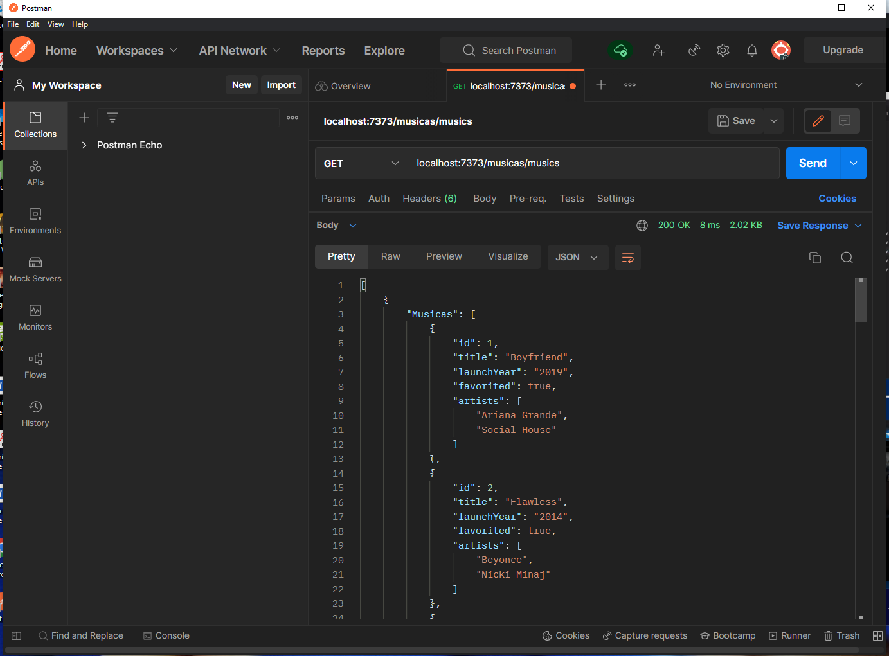
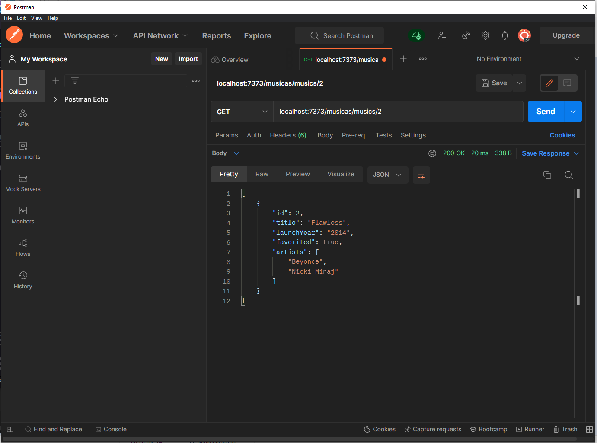
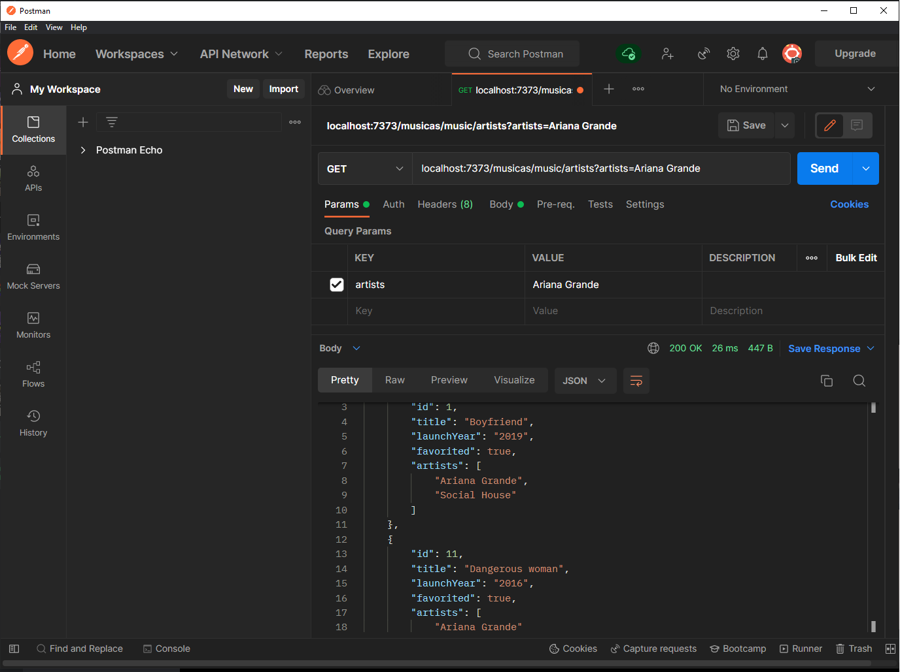
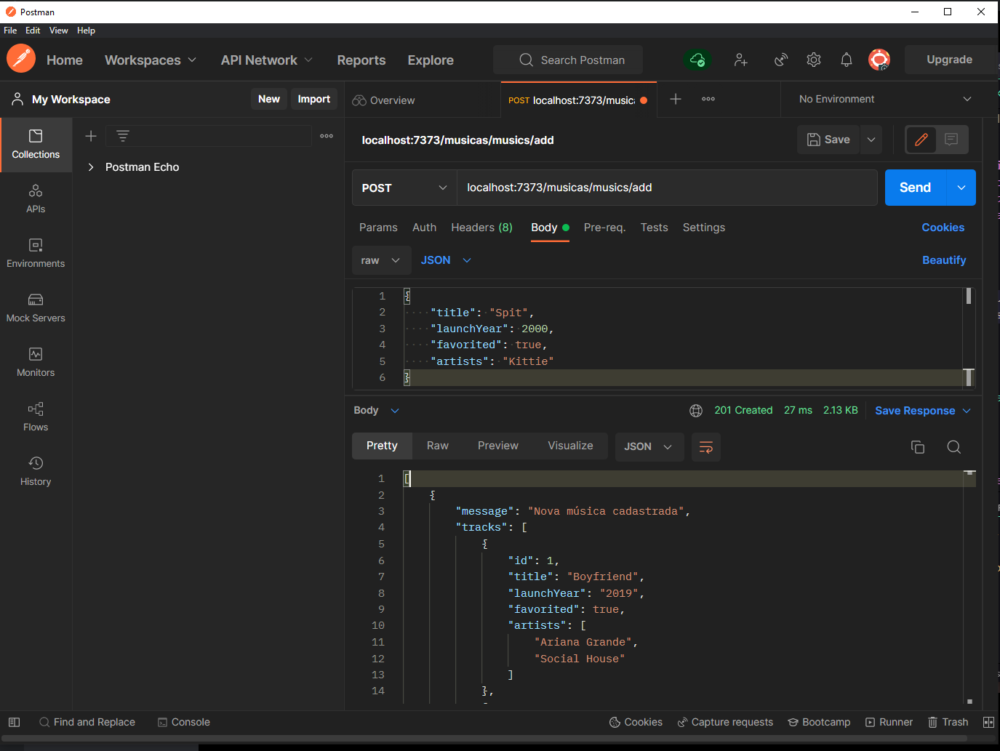
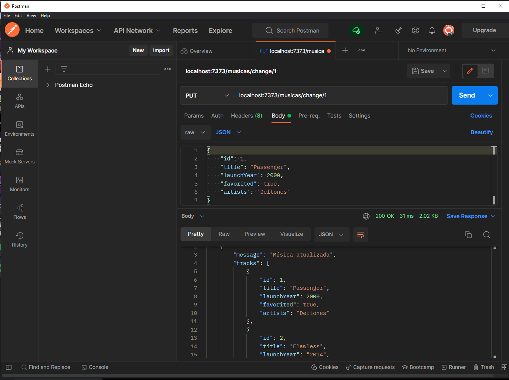
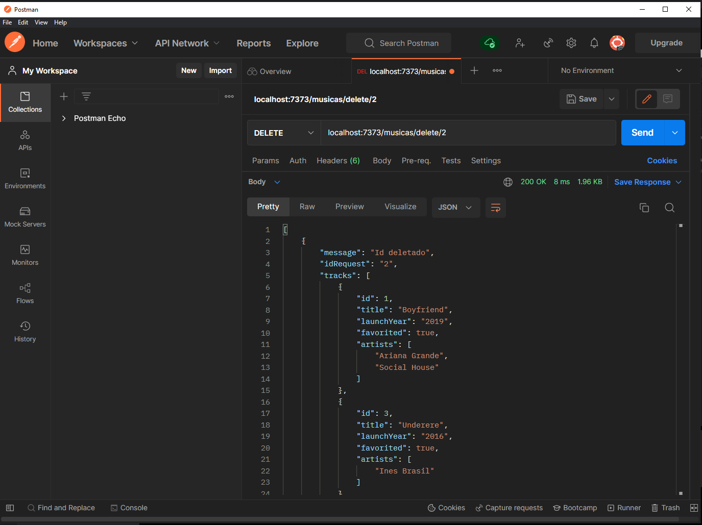
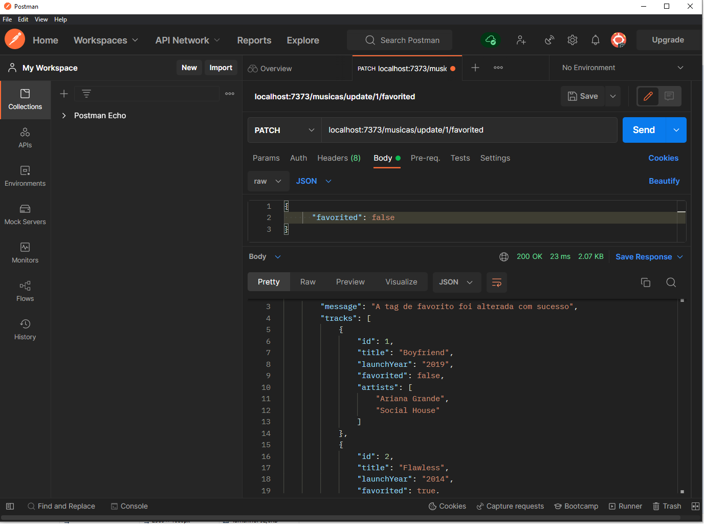

<h1 align="center">
    <br>
    <p align="center">Projeto S10 {Reprograma}fy 🔊<p>
</h1>
<p align="center">

</p>
<p align="center">
 
</p>

### Projeto Reprogramafy:

O projeto Reprogramafy é uma API REST criada como um projeto guiado para a semana 10 do curso da {Reprograma}

A interface é um CRUD, onde é possível listar as músicas/podcasts na base de dados; listar músicas através do ID; listar podcasts através de um tópico específico ; listar as músicas através de um artista específico; cadastrar novas músicas/podcasts; atualizar uma música específica; alterar músicas favoritadas; alterar a nota de um podcast; deletar músicas/podcasts específicos.

**E Como funciona?**

1. Clone o projeto através do comando:
`$git clone https://github.com/louicosta/On16-TodasEmTech-S10-Projeto-2-CRUD`

2. Inicialize o package.json com todas as configurações do projeto através dos comandos: </p>
`$npm install` </p>
`$npm i express`

4. Inicialize o Nodemon com o comando `npm start` para que você possa executar os testes localmente.


### Recursos e tecnologias utilizadas para a construção da API:

* **Node.Js** - versão 14.17.0;
* Dependências Node.Js:
   * **Express** - versão 4.18.1;
   * **Nodemon** - versão 2.0.13;
* **Git**;
* **Visual Studio Code**;
* **Postman**;


### Testando as rotas na sua máquina:

1. Abra o aplicativo [POSTMAN](https://chrome.google.com/webstore/detail/postman/fhbjgbiflinjbdggehcddcbncdddomop/related?hl=pt-BR);

2. Teste as rotas usando esta rota raiz na URL do Postman: localhost:7373/musicas/ 

3. As rotas/endpoints estão disponiveis na pasta 📁- routes 

4. Para utilizar as rotas de *POST, PUT e PATCH* deve-se usar no Postman os verbos de acordo e, clicar em *body* e posteriormente em *raw*, trocar de *text* para *JSON* e apertar *Send*.


### Estrututura de Arquivos da API:

```
├──📁src
│   ├──📁controllers
|   |  ├── musicasController.js
|   |  ├── podcastsController.js
│   ├──📁models
|   |  ├── musicas.json
|   |  ├── podcasts.json
│   ├──📁routes 
│   |  ├── musicasRoutes.js
|   |  ├── podcastsRoutes.js
|   ├── app.js
├── .gitignore
├── package-lock.json
├── package.json
├── server.js
```
</br>

### Manipulação das Rotas de Podcasts:

| Método HTTP | Endpoint                     | Descrição                                     |
| ----------- | ---------------------------- | --------------------------------------------- |
| ROTA RAIZ   | `/podcast`                   | Utilizada antes de todo endpoint              |
| GET         | `/biblioteca`                | Retorna todos os podcasts                     |
| GET         | `/biblioteca/tema`           | Retorna todos os podcasts por tópico          |
| POST        | `/adicionar`                 | Cadastra um novo podcast                      |
| PATCH       | `/atualizar/:id`             | Altera a nota de um podcast                   |
| DELETE      | `/delete/:id`                | Remove um podcast específico                  |

</br>

### Manipulação das Rotas de Músicas:

| Método HTTP | Endpoint                     | Descrição                                     |
| ----------- | ---------------------------- | --------------------------------------------- |
| ROTA RAIZ   | `/musicas`                   | Utilizada antes de todo endpoint              |
| GET         | `/musics`                    | Retorna todas as músicas                      |
| GET         | `/musics/:id`                | Retorna apenas uma música específica          |
| GET         | `/music/artists`             | Retorna músicas de um artista específico      |
| POST        | `/musics/add`                | Cadastra uma nova música                      |
| PUT         | `/change/:id`                | Atualiza uma música específica(exceto o ID)   |
| DELETE      | `/delete/:id`                | Remove uma música específica                  |
| PATCH       | `/update/:id/favorited`      | Favorita/Desfavorita uma música               |

</br>

### Alguns prints das requisições feitas no Postman:
</br>

| GET         | `/musics`                    | Retorna todas as músicas                      |


</br>
</br>

| GET         | `/musics/:id`                | Retorna apenas uma música específica          |


</br>
</br>

| GET         | `/music/artists`             | Retorna músicas de um artista específico      |


</br>
</br>

| POST        | `/musics/add`                | Cadastra uma nova música                      |


</br>
</br>

| PUT         | `/change/:id`                | Atualiza uma música específica(exceto o ID)   |


</br>
</br>

| DELETE      | `/delete/:id`                | Remove uma música específica                  |


</br>
</br>

| PATCH       | `/update/:id/favorited`      | Favorita/Desfavorita uma música               |



</br>
</br>
</br>

### Se você se interessou pela playlist de músicas do {Reprograma}fy só clicar na imagem:
</br>
<p align=center>

</br>
 ![Reprogramafy] (https://open.spotify.com/playlist/6F5yMuNt1jz33sBnRgWmSx?si=5avZgYKSTY-doIZ1Rj2NsA&utm_source=copy-link);
 [POSTMAN](https://chrome.google.com/webstore/detail/postman/fhbjgbiflinjbdggehcddcbncdddomop/related?hl=pt-BR)

</br>
</br>

<span align="center">

#  Muito obrigada a você que chegou até aqui! </h2>

</span>

<p align="center">

</p>
<p align="center">
  <a> 
