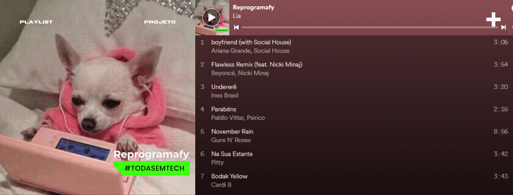
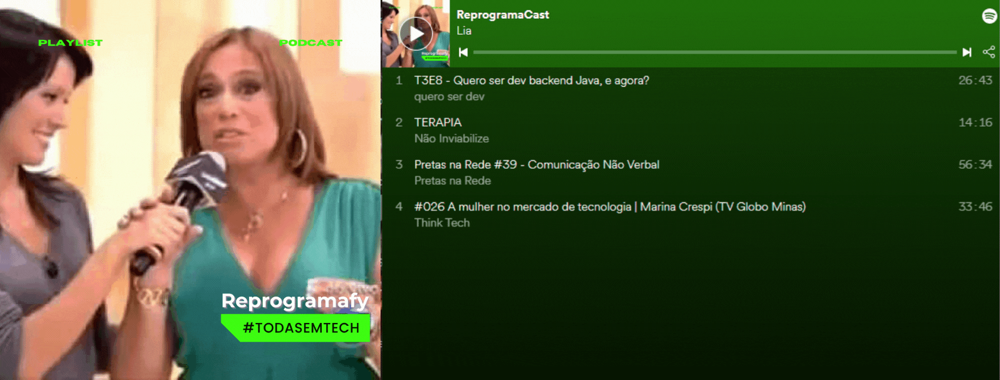

<h1 align="center">
    <br>
    <p align="center">Atividade Semanal 10 - Turma On16 📚 💻<p>
</h1>


Neste projeto guiado denominado "Reprogramafy" criamos uma API em NodeJs para manuseio de listas de músicas e podcasts.
Neste processo conseguimos entender o uso dos principais métodos HTTP executando as rotas via Postman e inserindo alguns métodos como recursos do Express e Javascript para manuseios especificos, tais como os métodos de busca ```includes```, ```find```, ```findInex```, ```filter```, o ```math.floor``` para gerar id aleatório quando utilizamos o método POST, além do método ```splice``` usado na inserção de novo elemento da Array de músicas e podcasts. Também configuramos tratamentos de erro utilizando ````try/catch```` e ```if/else```.


### 📏 Arquitetura MVC
Além disso adotamos o padrão MVC como base para organizar o projeto, deste modo temos a seguinte arquitetura:

```
📂 reprogramafy
├── 📁 img
├── 📂src
│   ├── 📂controllers
|       ├── 📃 musicasController.json
|       ├── 📃 podcastsController.json
│   ├── 📂models
|       ├── 📃 musicas.json
|       ├── 📃 podcasts.json
│   ├── 📂routes
│       ├── 📃 musicasRoutes.js
│       ├── 📃 podcastsRoutes.js
|   ├── 📃 app.js
├── 📃 .gitignore
├── 📃 package-lock.json
├── 📃 package.json
├── 📃 server.js
```


### 🎧 Configurando rotas para playlist de músicas
<a href="https://open.spotify.com/embed/playlist/6kNTCwrdqGXgEF4ZRFOvyc?utm_source=generator"></a>

Na configuração das rotas para manipular a playist de músicas temos a seguinte estrutura disponível:

| Verbo  | Rota                                                    | Descrição da Rota                             | 
| :----: | :------------------------------------------------------:|:---------------------------------------------:|
| GET    | localhost:1313/playlist/musicas                         | listar todas as músicas da playlist do usuário| 
| GET    | localhost:1313/playlist//musicas/buscar/:id             | listar apenas uma música específica           |
| GET    | localhost:1313/playlist/musicas/artista?artist=beyonce  | listar  músicas de um artista específico      |
| POST   | localhost:1313/playlist/musicas                         | adicionar uma nova música                     |
| DELET  | localhost:1313/playlist//delete/:id                     | remover uma música da lista                   |
| PUT    | lcalhost:1313/playlist/alterar/:id                      | alterar informações da música                 |
| PATCH  | localhost:1313/playlist/atualizar/:id                   | favoritar/desfavoritar uma música             |


### 🎤 Configurando rotas para lista de podcasts
<a href="https://open.spotify.com/embed/playlist/6kNTCwrdqGXgEF4ZRFOvyc?utm_source=generator"></a>

    
Na confuguração das rotas para manipular a lista de podcasts temos a seguinte estrutura disponível:

| Verbo  | Rota                                                    | Descrição da Rota                      |
| :----: | :------------------------------------------------------:|:--------------------------------------:|
| GET    | localhost:1313/podcast/biblioteca                       | Listar podcasts                        |
| GET    | localhost:3000/podcast/biblioteca/tema?topic=tecnologia | Listar podcast por tópico              |  
| POST   | localhost:1313/podcast/biblioteca                       | adicionar uma nova música              |
| DELET  | localhost:1313/podcast//delete/:id                      | remover podcast                        |
| PATCH  | localhost:1313/podcast//atualizar/:id                   | alterar a classificação de um podcast  |  


___
<h6 align="center">
    <br>
    <p align="center">Essa atividade faz parte do cronograma da semana 10 da Turma On16 do bootcamp Todas em Tech <p>
     
</h6>
